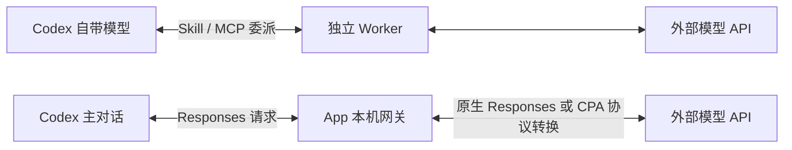

# API Subagents

在一个桌面 App 中配置外部模型，让 Codex 使用你选择的服务。支持 OpenAI 兼容 / CPA、Responses、Claude 和 Gemini。

Windows 10/11 x64 · Go + Wails · 无需 Node.js · 使用系统 WebView2

## 先选一种用法

| 模式 | 适合什么情况 | 如何开启 |
| --- | --- | --- |
| **插件委派** | Codex 负责主任务，将批量注释、机械修改等工作交给低价模型 | 在「插件管理」中安装，在对话中指定任务和连接 |
| **挟持模式** | 希望外部模型直接承担 Codex 主对话，包括 Codex 套餐额度用完时 | 保存连接，打开连接标题旁的「挟持模式」开关 |

挟持模式通过 Codex 自定义模型提供商接入。模型请求使用所选服务的 API，按该服务计费；插件委派仍需要 Codex 主模型参与，不能保证总 token 用量更少。

## 工作原理

**插件委派**：Skill 引导 Codex 把明确的子任务交给 MCP Worker。Worker 读取任务范围内的文件、调用外部模型，返回精简结果或修改建议，再由 Codex 检查并应用。插件安装后独立运行，App 可以关闭。任务拆分、调度和复核仍使用 Codex 自带模型，所以它适合分担批量工作，不能解决 Codex 额度完全用尽的问题。

**挟持模式**：App 启动带随机令牌的本机网关，备份并调整 Codex 的模型提供商设置，生成可切换的模型目录。Codex 主对话的请求会发往这个网关；上游支持原生 Responses 时直接转发，其他接口由 CPA SDK 转换为 OpenAI 兼容、Claude 或 Gemini 协议，并将结果以流式形式返回。模型生成费用由所选 API 服务收取，App 不读取或自动判断 Codex 套餐余额。使用期间需要保持 App 运行。

**配置与恢复**：桌面界面通过固定 Go 绑定读写本机配置；`Configure.cmd` 使用带会话令牌的本地接口，二者共用同一份连接配置。Key 不随源码或安装包分发。关闭挟持模式后恢复原模型设置，并保留供旧对话打开的提供商占位；异常退出后，下次启动会尝试恢复。详细边界见 [连接与使用](docs/usage.md)。

## 开始使用

1. 从 [Releases 下载 Windows 安装包](https://github.com/U109/api-subagents/releases/latest)，双击安装并打开。
2. 点击「添加连接」，填写 API 地址、Key，在「模型选择」中选择模型与思考等级后保存。
3. 使用插件委派：打开侧栏「插件管理」，点击「安装到 Codex」，然后在 Codex 新建对话。
4. 使用挟持模式：选中已保存连接并开启，**首次开启后重启 Codex**。在 Codex 的模型列表选择具体连接，或选择「跟随 App 选择」。左侧绿色标识会显示正在使用的连接。

挟持模式运行期间需保持 App 打开。关闭后恢复原默认模型，旧对话仍可打开；继续使用外部模型需重新开启。更新模型列表或默认思考等级后，重启 Codex 刷新。普通插件可在 App 关闭后独立运行。

连接重命名在「连接信息」中修改；侧栏「⋯」菜单提供复制和删除。配置与 Key 保存在本机，更新不会清除。

## 更新

在右上角打开「检查更新」，依次点击「下载 → 重启并更新」。使用插件的用户随后在「插件管理」中点击「更新插件」，并在 Codex 新建对话。

0.2.0 / 0.2.1 需要先从 Releases 手动覆盖安装一次；0.2.2 可直接更新到新版。首次运行缺少 WebView2 时按提示安装微软运行时。安装包目前未签名。

## 最新更新

### 2026-09-17

- 配置页采用白底布局、可收起侧栏与固定保存栏；下拉菜单样式统一，思考等级可直接点选。
- 插件管理、更新和帮助独立呈现；挟持模式入口更清楚，关闭后旧对话仍可打开。
- 补充两种模式的调用原理、计费与配置恢复说明。

[完整更新记录](docs/releases/release-notes.md)

## 从源码安装

克隆仓库或下载 ZIP 并解压后，双击 **`Install.cmd`**。它会自动准备经过校验的 Go 工具链、下载依赖、编译并安装插件。首次运行需要联网，无需手工执行 npm 命令。

双击 **`Configure.cmd`** 打开浏览器配置页。源码入口与桌面 App 共用本机配置；挟持模式在桌面 App 中开启。

详细说明：[连接与使用](docs/usage.md) · [目录与构建](docs/architecture.md)
