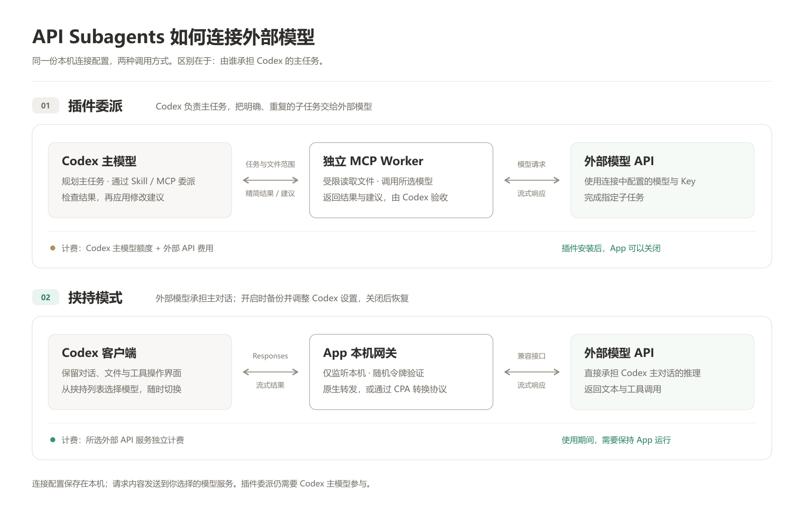

# API Subagents

在一个桌面 App 中配置外部模型，让 Codex 使用你选择的服务。支持 OpenAI 兼容 / CPA、Responses、Claude 和 Gemini。

Windows 10/11 x64 · Go + Wails · 无需 Node.js · 使用系统 WebView2

## 先选一种用法

| 模式 | 适合什么情况 | 如何开启 |
| --- | --- | --- |
| **插件委派** | Codex 负责主任务，将批量注释、机械修改等工作交给低价模型 | 在「插件管理」中安装，在对话中指定任务和连接 |
| **挟持模式** | 希望外部模型直接承担 Codex 主对话，包括 Codex 套餐额度用完时 | 保存连接，打开连接标题旁的「挟持模式」开关 |

挟持模式通过 Codex 自定义模型提供商接入。模型请求使用所选服务的 API，按该服务计费；插件委派仍需要 Codex 主模型参与，不能保证总 token 用量更少。

## 工作原理

两种模式共用本机连接配置，不读取 Codex 套餐剩余额度。退出 App 会自动关闭挟持模式、恢复原模型设置并保留旧对话入口；异常退出后，下次启动会尝试恢复。Key 不随源码或安装包分发。详细说明见 [连接与使用](docs/usage.md)。

## 开始使用

1. 从 [Releases 下载 Windows 安装包](https://github.com/U109/api-subagents/releases/latest)，双击安装并打开。
2. 点击「添加连接」，填写 API 地址、Key。在「模型选择」刷新列表，搜索并勾选要在 Codex 中使用的模型，点击行内「设为默认」，选好思考等级后保存。服务未列出的模型可手动添加。
3. 使用插件委派：打开侧栏「插件管理」，点击「安装到 Codex」，然后在 Codex 新建对话。
4. 使用挟持模式：选中已保存连接并开启，**首次开启后重启 Codex**。在 Codex 模型列表选择「连接名 · 模型名称」（未命名时显示 ID），或选择「跟随 App 选择」。左侧绿色标识会显示正在使用的连接。

挟持模式运行期间需保持 App 打开。关闭后恢复原默认模型，旧对话仍可打开；继续使用外部模型需重新开启。更新模型列表或默认思考等级后，重启 Codex 刷新。普通插件可在 App 关闭后独立运行。

连接名称支持中文、空格和符号，可在「连接信息」中重命名；侧栏「⋯」菜单提供复制和删除。修改地址或接口类型后仍保留原 Key，配置与 Key 保存在本机，更新不会清除。

## 更新

在右上角打开「检查更新」，可查看 App 当前版本，并依次点击「下载 → 重启并更新」。

插件管理单独显示已安装版本与 App 附带版本。点击「检查插件更新 → 更新至…」，即可下载并安装插件，无需更新或重启 App；安装后在 Codex 新建对话。首次安装也可使用 App 附带的插件。

0.2.0 / 0.2.1 需要先从 Releases 手动覆盖安装一次；0.2.2 可直接更新到新版。首次运行缺少 WebView2 时按提示安装微软运行时。安装包目前未签名。

## 最新更新

### 2026-09-17

- 界面字号整体增大一档，表单、模型列表、弹窗和提示更易阅读，并调整按钮与下拉框高度。
- 连接名称取消格式和长度限制，支持中文、空格、大小写和符号；复制保留完整名称，在 Codex 中切换模型也能正确识别。
- 修改 API 地址或接口类型后可继续使用已保存的 Key，原环境变量设置保持生效，无需重新填写或清除。
- 修复开启挟持模式后无法退出：关闭窗口会自动恢复 Codex 配置并停止连接；未保存修改使用页面内弹窗提醒。
- 配置页采用白底布局、可收起侧栏与固定保存栏；下拉菜单样式统一，思考等级可直接点选。
- 模型选择合并为可搜索的勾选列表，支持只看已选、行内设默认和手动添加；可修正上游模型 ID，并单独设置显示名称，刷新目录保留已选配置。
- 操作结果改为顶部浮动提示，修复删除按钮文字；App 版本移入更新窗口，插件支持独立检查与更新。
- 新增挟持模型列表，同一连接可添加多个模型，在 Codex 中直接切换；插件委派的默认模型保持独立。
- 用原理图说明两种调用方式和计费；挟持模式关闭后旧对话仍可打开。

[完整更新记录](docs/releases/release-notes.md)

## 从源码安装

克隆仓库或下载 ZIP 并解压后，双击 **`Install.cmd`**。它会自动准备经过校验的 Go 工具链、下载依赖、编译并安装插件。首次运行需要联网，无需手工执行 npm 命令。

双击 **`Configure.cmd`** 打开浏览器配置页。源码入口与桌面 App 共用本机配置；挟持模式在桌面 App 中开启。

详细说明：[连接与使用](docs/usage.md) · [目录与构建](docs/architecture.md)
